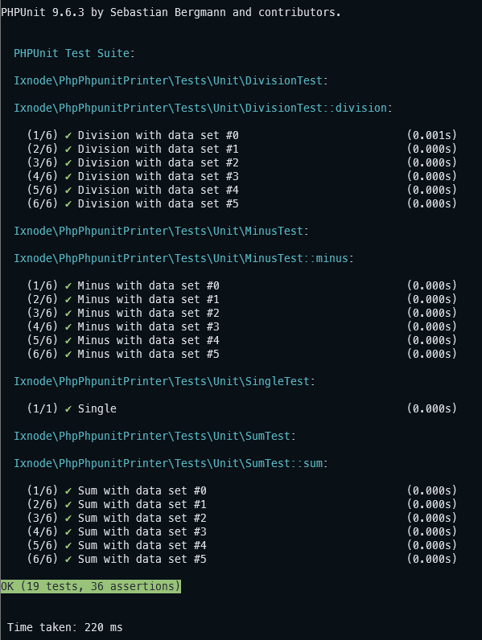

# PHP Container

[](https://github.com/ixnode/php-phpunit-printer/releases)
[](https://www.php.net/supported-versions.php)
[](https://phpstan.org/user-guide/rule-levels)
[](https://www.php-fig.org/psr/psr-12/)
[](https://github.com/ixnode/php-phpunit-printer/blob/master/LICENSE)

> Overwrites the PHPUnit Printer with formatted output.

## 1) Installation

```bash
composer require --dev ixnode/php-phpunit-printer
```

```bash
vendor/bin/php-phpunit-printer -V
```

```bash
php-phpunit-printer 0.1.0 (02-04-2023 22:33:53) - Björn Hempel <bjoern@hempel.li>
```

## 2) Usage



After installing this Composer package, you can edit your phpunit.xml as follows:

```xml
<phpunit
    ...
    printerClass="Ixnode\PhpPhpunitPrinter\Printer"
>
    ...
</phpunit>
```

A complete phpunit.xml example could look like this:

```xml
<?xml version="1.0" encoding="UTF-8"?>

<!-- https://phpunit.readthedocs.io/en/latest/configuration.html -->
<phpunit xmlns:xsi="http://www.w3.org/2001/XMLSchema-instance"
         xsi:noNamespaceSchemaLocation="vendor/phpunit/phpunit/phpunit.xsd"
         backupGlobals="false"
         colors="true"
         convertDeprecationsToExceptions="false"
         stopOnFailure="true"
         printerClass="Ixnode\PhpPhpunitPrinter\Printer"
>
    <php>
        <ini name="display_errors" value="1"/>
        <ini name="error_reporting" value="-1"/>
        <server name="APP_ENV" value="test" force="true"/>
        <server name="SHELL_VERBOSITY" value="-1"/>
        <server name="SYMFONY_PHPUNIT_REMOVE" value=""/>
        <server name="SYMFONY_PHPUNIT_VERSION" value="9.5"/>
        <env name="SYMFONY_DEPRECATIONS_HELPER" value="disabled"/>
    </php>

    <testsuites>
        <testsuite name="PHPUnit Test Suite">
            <directory>tests</directory>
        </testsuite>
    </testsuites>

    <coverage processUncoveredFiles="true">
        <include>
        </include>
    </coverage>
</phpunit>
```

## 3.) Development

```bash
git clone git@github.com:ixnode/php-phpunit-printer.git && cd php-phpunit-printer
```

```bash
composer install
```

```bash
composer test
```

## 4.) License

This tool is licensed under the MIT License - see the [LICENSE](/LICENSE) file for details